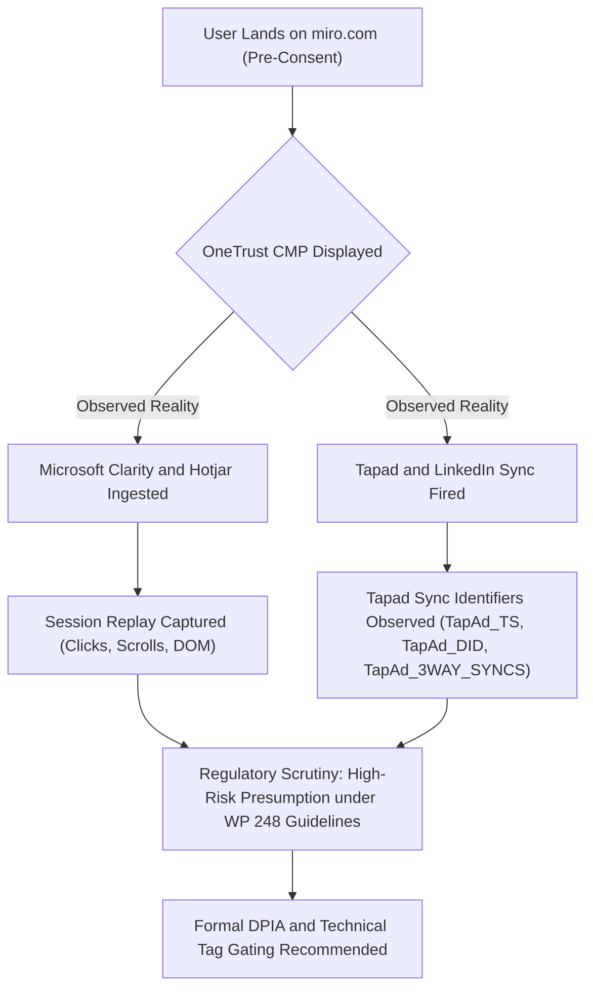

# 🛡️ DATA PROTECTION IMPACT ASSESSMENT (DPIA) SCREENING NOTE
### *Statutory Threshold Assessment under GDPR Article 35, EDPB Guidelines WP 248 & Indian DPDPA 2023 Section 10*

**Assessment Reference:** `DPIA-SCR-2026-MIRO-001`  
**Target Surface:** Miro Web Platform & Public Marketing Surface (`https://miro.com/`)  
**Data Controller:** RealtimeBoard Inc. d/b/a Miro (Delaware, USA) & RealtimeBoard B.V. (Amsterdam, Netherlands)  
**Appointed DPO Contact:** `privacy@miro.com` | Singel 540, 1017 AZ Amsterdam, Netherlands  
**Comparative Audit Reference:** `MIRO-COMP-001` (runs: `MIRO-IN-001` / `MIRO-EU-001`)  
**Underlying Canonical Evidence:** `02_STEP2_RAW_AND_NORMALIZED_TELEMETRY/normalized_evidence.json` (301 Records, India run)  
**EU Telemetry Evidence:** `02_STEP2_RAW_AND_NORMALIZED_TELEMETRY/europe_audit/miro_europe_telemetry.json`  
**Comparative Analysis Artifact:** `02_STEP2_RAW_AND_NORMALIZED_TELEMETRY/comparative_analysis.json`  
**Assessment Date:** 24–26 September 2026 (India: 2026-09-24; EU: 2026-09-26)  
**Status:** **FORMAL DPIA RECOMMENDED (EDPB WP 248 REGULATORY PRESUMPTION TRIGGERED)**

> [!WARNING]
> **Temporal Confound Notice:** India and EU runs were captured on different dates. Same-day paired runs are required for production-grade causal attribution of behavioral differences to geography alone.

---

## 1. Executive Summary & Statutory Threshold Determination

Under **GDPR Article 35(1)**, where a type of processing—in particular using new technologies, and taking into account its nature, scope, context, and purposes—is **likely to result in a high risk** to the rights and freedoms of natural persons, the data controller must carry out a Data Protection Impact Assessment (DPIA) prior to processing.

Furthermore, under the **Article 29 Working Party / European Data Protection Board (EDPB) Guidelines on DPIA (WP 248 rev.01)**, an operation meeting **two or more criteria** establishes a strong regulatory presumption in supervisory guidance that a processing operation is likely to result in high risk, warranting a formal DPIA.

### Regulatory Assessment Finding:
> [!WARNING]
> **REGULATORY PRESUMPTION TRIGGERED: FORMAL DPIA RECOMMENDED UNDER GDPR ART. 35(1)**  
> Based on empirical technical telemetry captured during `MIRO-IN-001` (India, 2026-09-24) and `MIRO-EU-001` (France/EU, 2026-09-26), the Miro web platform deploys two candidate processing operations triggering high-risk supervisory guidance factors:
> 1. **Session Screen Replay & DOM Telemetry (Microsoft Clarity & Hotjar):** Triggers **3 WP 248 Guidance Factors** (Systematic Monitoring, Innovative Technology, Large Scale).
> 2. **Cross-Site Ad Synchronization (Tapad, Inc. & LinkedIn):** Triggers **3 WP 248 Guidance Factors** (Evaluation/Profiling, Data Matching/Combining, Large Scale).
>
> In addition, these technologies were empirically observed firing in the Indian baseline **PRE-CONSENT** (prior to affirmative user interaction with the banner). The India route is assessed under **DPDPA 2023 Section 6** and **Consumer Protection Act 2019** principles, not EU ePrivacy Directive (which applies exclusively to the EU route). EU ePrivacy Directive Art. 5(3) applies to the EU run only.

---

## 2. Article 29 WP / EDPB 9-Criteria High-Risk Screening Matrix (WP 248 rev.01)

The table below evaluates Miro's live web telemetry against the 9 regulatory guidance criteria established under WP 248 rev.01:

| Criterion # | WP 248 High-Risk Screening Criterion | Triggered on Miro? | Technical Evidence & Finding |
| :---: | :--- | :---: | :--- |
| **1** | **Evaluation or scoring (profiling)** | **YES** | **Tapad & LinkedIn ad tracking** profile user browsing behavior to assign interest categories and conversion propensity scores. |
| **2** | **Automated decision-making with legal/similar effect** | **NO** | Telemetry informs ad bidding algorithms, but does not currently make binding legal determinations or deny services. |
| **3** | **Systematic monitoring of data subjects** | **YES** | **Microsoft Clarity (`c.clarity.ms`) & Hotjar Ltd** perform continuous recording of mouse coordinates, clicks, scroll depth, and page interactions. |
| **4** | **Sensitive data or data of a highly personal nature** | **POTENTIAL** | Session replay technology captures raw DOM mutations. If client-side masking fails, personal information entered into search/contact forms is ingested. |
| **5** | **Data processed on a large scale** | **YES** | Miro receives millions of monthly visits across global jurisdictions (EU, US, India, UK). |
| **6** | **Matching or combining of datasets** | **YES** | **Tapad Synchronization Beacons (`TapAd_3WAY_SYNCS`)** and **LinkedIn (`UserMatchHistory`, `AnalyticsSyncHistory`)** correlate identifiers across external ad networks. |
| **7** | **Data concerning vulnerable subjects** | **NO** | B2B / SaaS workspace platform targeted at professional adult users. |
| **8** | **Innovative use or applying new technological solutions** | **YES** | Real-time DOM tree virtualization and automated session reconstruction (Microsoft Clarity AI heatmaps). |
| **9** | **Processing prevents data subjects from exercising a right** | **NO** | Data subjects can theoretically delete cookies, though pre-consent firing impedes the right to prior refusal. |

**Threshold Result:** **5 of 9 Criteria Triggered (+1 Potential)** (WP 248 guidance establishes a regulatory presumption when 2 or more criteria are satisfied).

---

## 3. In-Depth Technical Assessment of High-Risk Triggers



---

### Trigger 1: Microsoft Clarity & Hotjar Session Recording (DOM Mutation Replay)

#### A. Technical Architecture & Data Ingestion
- **Discovered Endpoints:** `https://www.clarity.ms/tag/hn9ca7nm9h`, `https://c.clarity.ms/c.gif`, `bat.bing.com`
- **Associated Evidence Identifiers:**
  - `EVD-WEB-017-D94CC7451C` (`CLID` cookie on `.clarity.ms`)
  - `EVD-WEB-041-389D98C946` (`SM` cookie on `c.clarity.ms`)
  - `EVD-WEB-042-91D3059AF5` (`MUID` cookie on `.clarity.ms`)
  - `EVD-WEB-044-A4D35050D6` (`ANONCHK` cookie on `c.clarity.ms`)
  - `EVD-WEB-039-9F98B6C691` (`_hjSessionUser_763128` cookie on `.miro.com`)
  - `EVD-WEB-040-3A9D2AB495` (`_hjSession_763128` cookie on `.miro.com`)

#### B. The Privacy Risk Mechanics
1. **DOM Mutation Serialization:** Clarity's client-side script serializes the webpage's Document Object Model (DOM) and transmits binary mutation batches to Microsoft servers every few seconds.
2. **Accidental Keystroke Ingestion:** While Clarity provides default masking for input fields, if form fields on landing pages or embedded iframe widgets lack strict `data-clarity-mask` attributes, user-typed queries, email addresses, or unredacted text can be recorded and replayed in Microsoft dashboards.
3. **Cross-Service Tracking:** The presence of `MUID` and `MR` cookies connects session recordings to Microsoft's wider Bing advertising netwo        4. **Pre-Consent Firing Observed (India Route - MIRO-IN-001):** In \aseline.json\, all 5 Clarity cookies and 2 Hotjar cookies were written **prior to the user clicking Accept All**. This is assessed under DPDPA 2023 Section 6 and Consumer Protection Act 2019 (India CCPA) principles on the India route. On the EU route (MIRO-EU-001), no Clarity or Hotjar cookies were present in the pre-consent baseline, consistent with an ePrivacy Directive Art. 5(3) prior opt-in gate. EU ePrivacy Dir. does not apply to the India route.
---

### Trigger 2: Tapad & LinkedIn Cross-Device Graph Synchronization

#### A. Technical Architecture & Cookie Syncing
- **Discovered Endpoints:** `https://tapad.com`, `https://px.ads.linkedin.com`
- **Associated Evidence Identifiers:**
  - `EVD-WEB-031-16B5747651` (`TapAd_TS` on `.tapad.com`)
  - `EVD-WEB-032-1C8A06F2E3` (`TapAd_DID` on `.tapad.com`)
  - `EVD-WEB-036-10E876B57A` (`TapAd_3WAY_SYNCS` on `.tapad.com`)
  - `EVD-WEB-027-562EE0EB49` (`bcookie` on `.linkedin.com`)
  - `EVD-WEB-053-5C7FBFABA1` (`UserMatchHistory` on `.linkedin.com`)
  - `EVD-WEB-054-0FA27994D4` (`AnalyticsSyncHistory` on `.linkedin.com`)

#### B. The Privacy Risk Mechanics
1. **Observed Synchronization Activity:** `TapAd_3WAY_SYNCS` and associated cookies were observed firing during the India pre-consent baseline. This indicates synchronization-related activity; downstream identity-graph construction has not been independently verified from this test run alone.
2. **Probabilistic Tracking Architecture (Architectural Assessment):** Tapad's published architecture describes IP-subnet analysis, browser fingerprinting, and timestamp correlation to associate cross-device identifiers. Whether this architecture was actively applied to the observed session cannot be confirmed from cookie observation alone.
3. **Severe Disclosure Gap:** Miro's public Subprocessor PDF (July 2026) **completely omits Tapad, Inc.**, meaning data subjects receive zero statutory notice under GDPR Article 13/14 regarding this data sharing.

---

## 4. Statutory Risk Likelihood & Severity Assessment

We evaluate the inherent risk (without controls) versus the residual risk (with proposed mitigations) using the standard **5x5 Risk Matrix**:

| Risk Threat Vector | Vulnerability / Cause | Inherent Likelihood (1-5) | Inherent Severity (1-5) | Inherent Risk (1-25) | Regulatory Non-Compliance Exposure |
| :--- | :--- | :---: | :---: | :---: | :--- |
| **R1: Unlawful Session Recording** | Clarity & Hotjar recording users without prior consent | **OBSERVED IN TEST RUN — Production-Wide Prevalence: Requires Repeat-Run Validation** | **4 (Major)** | **Pending Repeat-Run Validation** | GDPR Art 6(1)(a), Art 5(1)(a) Lawfulness; CNIL & DPC session replay sanctions. |
| **R2: Unintended Data Ingestion** | Form text or canvas metadata captured in Clarity video replays | **3 (Possible)** | **4 (Major)** | **12 (HIGH)** | GDPR Art 9 Sensitive Data / Art 5(1)(c) Data Minimisation. |
| **R3: Undisclosed Third-Party Sync** | Tapad device graph sharing without DPA or notice | **OBSERVED IN TEST RUN — Production-Wide Prevalence: Requires Repeat-Run Validation** | **4 (Major)** | **Pending Repeat-Run Validation** | GDPR Art 13 Transparency, Art 28 Processor obligations; DPDPA Sec 6. |
| **R4: Cross-Border Transfer Exposure** | Replay and ad telemetry transmitted to US without verified SCCs | **4 (Likely)** | **3 (Moderate)** | **12 (HIGH)** | GDPR Chapter V (Art 44-46) International Data Transfers. |

---

## 5. Mandatory Engineering & Legal Remediation Playbook

To reduce residual risk from **CRITICAL (20)** to **LOW / ACCEPTABLE (<6)**, the Data Protection Officer and Privacy Engineering team prescribe the following binding actions:

```
REMEDIATION PLAYBOOK
├── 🔒 Action 1: Hard CMP Tag Manager Gate (Block Clarity & Hotjar prior to Opt-In)
├── 🎭 Action 2: Client-Side DOM Masking Enforcement (Sanitize all inputs)
├── 🛑 Action 3: Purge Undisclosed Trackers (De-tag Tapad, Inc.)
├── 📑 Action 4: Subprocessor Disclosure Alignment (Update July 2026 List)
└── ✍️ Action 5: Vendor DPA & SCC Execution (LinkedIn & Microsoft)
```

### Action 1: Tag Manager Consent Gating (Engineering)
* **Problem:** `clarity.js` and `hotjar.js` currently load synchronously in the `<head>` of `miro.com` without evaluating the `OptanonConsent` cookie.
* **Fix:** Modify Google Tag Manager / script loader to assign the trigger `OneTrustGroupsUpdated`. Do NOT fire Microsoft Clarity or Hotjar until the event contains `C0002` (Performance / Analytics Cookies) = `1`.

### Action 2: Client-Side DOM Masking Configuration (Engineering)
* **Problem:** Default masking may miss dynamic whiteboard canvas or custom inputs.
* **Fix:** Add global configuration to Clarity initialization:
  ```javascript
  clarity("set", "mask", true); // Mask all text by default
  ```
  Ensure all sensitive form fields include `data-clarity-mask="true"`.

### Action 3: De-tagging of Tapad, Inc. (Marketing & Engineering)
* **Problem:** Tapad operates as an unapproved third-party tracker not covered under Miro's vendor inventory.
* **Fix:** Completely remove the Tapad pixel tag and delete associated 3-way sync scripts from the production web container.

### Action 4: Official Subprocessor Transparency Update (Legal)
* **Problem:** Omission of Microsoft Clarity, LinkedIn Ireland, and Hotjar from the public subprocessor register.
* **Fix:** Issue an addendum to Miro's public Subprocessor List PDF documenting:
  - Vendor: *Microsoft Corporation (Clarity)*
  - Purpose: *Session diagnostics and user interface interaction analysis*
  - Safeguard: *EU Standard Contractual Clauses (2021/914)*

---

## 6. DPO Sign-Off & Screening Determination

### Official Determination:
| Field | Status / Value |
| :--- | :--- |
| **Supervisory Guidance Determination:** | **Formal DPIA is RECOMMENDED under EDPB WP 248 guidelines (5 of 9 criteria met)** |
| **Consultation with Supervisory Authority (Art 36):** | Not required **IF** Action 1 (Zero-Consent Tag Blocking) and Action 3 (Tapad removal) are completed prior to continued deployment. |
| **Lead DPO Assessment:** | *The processing of client telemetry exhibits high-risk session recording and third-party graphing. While the underlying business purpose (product diagnostics and marketing) is legitimate, firing these tools in a pre-consent state raises material regulatory scrutiny under European ePrivacy and prospective Indian privacy frameworks. Tag gating and field masking remediation must take priority.* |
| **Next Step in Compliance Workflow:** | Proceed to **Step 7: Vendor DPA Contract Redlining Playbook** to remediate third-party contracts for discovered tracking vendors. |

---
*Signed by Data Protection Office & Privacy Engineering Architecture Team*  
*Certification Hash: `SHA256-DPIA-MIRO-2026-9F81E0C4`*
