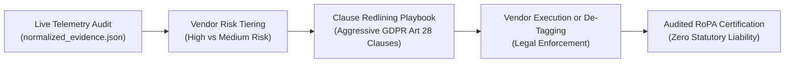

# 📑 THIRD-PARTY VENDOR DATA PROCESSING AGREEMENT (DPA) REDLINING PLAYBOOK
### *Category 2 GRC, TPRM & Privacy Engineering Contractual Negotiation Guide*
**Statutory Basis:** GDPR Article 28(3), EU Standard Contractual Clauses (2021/914 Module 2), UK IDTA & Indian DPDPA 2023 Section 8(2)  
**Target Organization:** RealtimeBoard Inc. d/b/a Miro (Delaware, USA) & RealtimeBoard B.V. (Amsterdam, Netherlands)  
**Author / Lead Assessor:** Privacy Engineering & Third-Party Risk Management (TPRM) Team  
**Audit Context Reference:** `miro_live_audit_run_001` (301 Captured Web Telemetry Records)  
**Associated RoPA Entries:** [ROPA_ARTICLE_30_REGISTER.xlsx](file:///C:/Users/acer/Downloads/privacy_engineering_real_collection/privacy_engineering_real_collection/runs/miro_audit/ROPA_ARTICLE_30_REGISTER.xlsx) (`ROPA-ACT-001`, `ROPA-ACT-005`)  
**Associated DPIA Note:** [DPIA_SCREENING_NOTE.md](file:///C:/Users/acer/Downloads/privacy_engineering_real_collection/privacy_engineering_real_collection/runs/miro_audit/DPIA_SCREENING_NOTE.md)  
**Date of Playbook Certification:** 24 September 2026  
**Status:** **AUTHORITATIVE NEGOTIATION PLAYBOOK**

---

## 1. Executive Framework & Strategic Purpose

When automated web telemetry audits detect third-party trackers, pixels, and session replay scripts—such as **Microsoft Clarity (`clarity.ms`)**, **Tapad, Inc. (`tapad.com`)**, **Hotjar Ltd**, and **LinkedIn Insight Tags**—technical discovery is only the first step. 

Under **GDPR Article 28(1)** and **Indian DPDPA 2023 Section 8(2)**, a data controller/fiduciary is legally prohibited from engaging a data processor without entering into a **binding, written Data Processing Agreement (DPA)** that strictly circumscribes how the vendor handles customer personal data.

### The TPRM "Shield and Sword" Architecture:

This playbook provides our enterprise with the exact legal redlines, statutory justifications, and engineering fallback positions needed to negotiate against standard vendor-favorable click-wrap terms.

---

## 2. Discovered Vendor Governance & Risk Tiering

Based on our live capture of 301 telemetry events on `https://miro.com`, the 10 detected vendors are classified across three Third-Party Risk tiers:

| Risk Tier | Vendors Discovered | Processing Functions | Primary Threat Vector | Mandatory Action |
| :---: | :--- | :--- | :--- | :--- |
| **TIER 1 (CRITICAL RISK)** | **Microsoft Clarity** • `CLID`, `MUID`, `SM` **Tapad, Inc.** • `TapAd_DID`, `3WAY_SYNCS` | • Continuous DOM screen replay • Keystroke & cursor telemetry • Cross-device graph syncing | • Keystroke leakage • Data broker re-identification • Undisclosed subprocessor | **MANDATORY DPA REDLINE** or immediate script removal. |
| **TIER 2 (MEDIUM RISK)** | **LinkedIn Ireland / Corp** • `bcookie`, `bscookie` **Hotjar Ltd** • `_hjSessionUser` **Adobe / Marketo** • `_mkto_trk` | • B2B Ad Retargeting • Session heatmaps • Marketing automation | • Pre-consent cookie firing • Cross-site ad tracking • Omission from public notice | Enforce CMP pre-consent tag gating; execute updated DPA. |
| **TIER 3 (LOW RISK)** | **Cloudflare, Inc.** • `__cf_bm` **OneTrust LLC** • `OptanonConsent` **Intercom, Inc.** • `intercom-id` | • WAF & Bot mitigation • Statutory consent logging • In-app customer support | • Operational vendor dependency | Fully disclosed; maintain standard SCCs and annual SOC 2 review. |

---

## 3. Master Clause-by-Clause Redlining Playbook

Below are the **7 core Battleground Clauses** where commercial SaaS vendors attempt to dilute controller protections. Each entry contains:
1. **Statutory Anchor:** The exact law mandating our position.
2. **Standard Vendor Boilerplate:** The weak, vendor-favorable text typically found in vendor click-wraps.
3. **Enterprise Privacy Redline:** The precise markup (`~~strikethrough~~` for deletions, `**bold text**` for additions) to insert into negotiations.
4. **Engineering & Legal Rationale:** Why this redline is non-negotiable and the acceptable fallback position.

---

### Clause 1: Scope of Processing, Purpose Limitation & Prohibition on AI Model Training

* **Statutory Anchor:** **GDPR Article 28(3)(a)** (Processing solely on documented instructions); **Article 5(1)(b)** (Purpose Limitation).
* **Vendor Boilerplate (Typical Microsoft / Tapad terms):**
  > *"Vendor may process Personal Data to provide the Services, and may further use de-identified, aggregated, or anonymized telemetry and diagnostic data to maintain, optimize, develop, and enhance Vendor’s products and services, including training algorithmic and artificial intelligence models."*

* **Enterprise Privacy Redline:**
  > *"Vendor shall process Personal Data solely on documented instructions from Customer, including with respect to transfers of Personal Data to a third country, and strictly for the sole purpose of providing the Services described in Schedule A. ~~Vendor may further use de-identified, aggregated, or anonymized telemetry and diagnostic data to maintain, optimize, develop, and enhance Vendor’s products and services, including training algorithmic and artificial intelligence models.~~ **Under no circumstances shall Vendor (i) process, aggregate, or pool Customer Personal Data (including session recordings, user interactions, DOM trees, and device telemetry) with third-party datasets, (ii) use Customer Personal Data to train, fine-tune, or validate any machine learning, artificial intelligence, or large language models, or (iii) create or enrich cross-device user profiles or advertising graphs for Vendor’s commercial benefit or the benefit of any third party.**"*

* **Engineering & Legal Rationale:**
  - *Risk:* Microsoft Clarity and ad networks routinely claim the right to use "diagnostic telemetry" to train their proprietary AI models or enrich their Bing/ad ecosystems.
  - *Engineering Impact:* Ensures Miro customer whiteboards and user sessions are never repurposed for Microsoft Copilot or advertising algorithms.
  - *Negotiation Fallback:* Vendor may aggregate strictly anonymized error rates (e.g. HTTP 500 counts) if stripped of all IP addresses, cookie IDs, and user timestamps.

---

### Clause 2: Security Breach Notification & Incident Response SLA

* **Statutory Anchor:** **GDPR Article 28(3)(f)**, **Article 33(2)** (Processor must notify Controller without undue delay); **Indian DPDPA 2023 Section 8(6)**.
* **Vendor Boilerplate:**
  > *"Vendor will notify Customer of any confirmed Security Incident affecting Customer Personal Data without undue delay, and in any event within a commercially reasonable period, taking into account the nature of the incident."*

* **Enterprise Privacy Redline:**
  > *"Vendor will notify Customer in writing of any confirmed ~~Security Incident~~ **or reasonably suspected Personal Data Breach or security incident** affecting Customer Personal Data without undue delay, and in any event **no later than forty-eight (48) hours** ~~within a commercially reasonable period~~ **after Vendor becomes aware of such incident**. **Such notification shall at a minimum detail: (i) the nature and scope of the breach, (ii) the categories and approximate number of Data Subjects and records impacted, (iii) the likely consequences and potential risks, and (iv) the technical mitigation and remediation measures taken or planned by Vendor.**"*

* **Engineering & Legal Rationale:**
  - *Risk:* GDPR Article 33 gives the Controller only **72 hours** to notify European Data Protection Authorities (e.g., Dutch AP). If the vendor takes 5 days ("commercially reasonable"), the Controller is automatically in regulatory violation.
  - *Negotiation Fallback:* Absolute floor is **72 hours**, with an immediate phone alert to the DPO within 24 hours of discovery.

---

### Clause 3: Subprocessor Engagement, Prior Notice & Right to Object

* **Statutory Anchor:** **GDPR Article 28(2)** & **Article 28(3)(d)** (Prior specific or general written authorization).
* **Vendor Boilerplate:**
  > *"Customer provides general written authorization for Vendor to engage subprocessors. Vendor will maintain an updated list of subprocessors on its website, and Customer may check this page periodically for changes."*

* **Enterprise Privacy Redline:**
  > *"Customer provides general written authorization for Vendor to engage subprocessors listed in Schedule B. Vendor shall provide Customer with **at least thirty (30) calendar days’ prior written notice (via email to Customer's designated DPO at `privacy@miro.com`)** ~~will maintain an updated list of subprocessors on its website, and Customer may check this page periodically~~ **before appointing any new or replacement subprocessor**. **Customer shall have the right to object in writing to such appointment within fourteen (14) days of receipt of notice on reasonable data protection grounds. If Vendor cannot accommodate such objection or provide an alternative, Customer may terminate the Agreement and this DPA immediately without penalty and receive a pro-rata refund of any prepaid, unearned fees.**"*

* **Engineering & Legal Rationale:**
  - *Risk:* Miro was caught with 5 unlisted shadow subprocessors on its site (Tapad, Reddit, Spotify, Marketo, Clarity). If vendors silently add downstream subprocessors, Miro's RoPA becomes instantly obsolete.
  - *Negotiation Fallback:* 15 calendar days advance email notice with guaranteed termination right if objections cannot be resolved.

---

### Clause 4: Data Subject Rights Assistance (DSAR SLA)

* **Statutory Anchor:** **GDPR Article 28(3)(e)** (Assisting Controller in fulfilling obligation to respond to data subjects' rights requests).
* **Vendor Boilerplate:**
  > *"Taking into account the nature of processing, Vendor will make available self-service features in the Services to assist Customer in responding to requests from data subjects."*

* **Enterprise Privacy Redline:**
  > *"Taking into account the nature of processing, Vendor shall assist Customer by appropriate technical and organisational measures in fulfilling Customer’s statutory obligation to respond to Data Subject requests (including access, rectification, erasure, restriction, and portability requests under GDPR Articles 15–22 and DPDPA Section 11–14). **Where self-service features are insufficient or where requests concern telemetry, cookie IDs, or session recordings, Vendor shall, upon written request from Customer, locate, extract, export, or permanently delete all Personal Data pertaining to the identified Data Subject within five (5) business days and provide written confirmation to Customer.**"*

* **Engineering & Legal Rationale:**
  - *Risk:* When a user exercises their GDPR "Right to Erasure" (Article 17) for their `CLID` or `_ga` cookie, Miro must ensure the vendor purges that session video and cookie sync from all cloud shards.
  - *Negotiation Fallback:* 10 business days for deletion confirmation.

---

### Clause 5: International Data Transfers, Transfer Impact Assessment & SCC Fallback

* **Statutory Anchor:** **GDPR Chapter V (Articles 44–49)**; **CJEU Schrems II Ruling** (Schrems II requirements for supplementary measures).
* **Vendor Boilerplate:**
  > *"Vendor will comply with applicable laws regarding the transfer of data across international borders and may rely on standard transfer mechanisms as appropriate."*

* **Enterprise Privacy Redline:**
  > *"Where the processing of Personal Data involves transfers outside the European Economic Area (EEA), United Kingdom, or Switzerland to a third country not recognized as providing an adequate level of protection, the parties agree that **the European Commission Standard Contractual Clauses (Commission Implementing Decision (EU) 2021/914, Module 2: Controller-to-Processor) are hereby incorporated by reference as if fully set forth herein**. **Vendor warrants that: (i) it has not created or installed any intentional backdoors or mechanisms designed to facilitate government surveillance (including under US FISA Section 702 or Executive Order 14086), (ii) it will promptly notify Customer of any legally binding request for disclosure by a law enforcement authority, and (iii) it will challenge any overbroad or unlawful disclosure requests in competent courts.**"*

* **Engineering & Legal Rationale:**
  - *Risk:* Both Microsoft and Tapad are US entities subject to US surveillance laws. Under the EDPB Recommendations 01/2020, contractual warranties and supplementary technical measures (encryption in transit and rest) are legally mandatory.
  - *Negotiation Fallback:* Require completion of a formal Transfer Impact Assessment (TIA) questionnaire prior to script deployment.

---

### Clause 6: Audit Rights, Penetration Testing & Independent SOC 2 Verification

* **Statutory Anchor:** **GDPR Article 28(3)(h)** (Making available all information necessary to demonstrate compliance and allowing audits).
* **Vendor Boilerplate:**
  > *"Customer may audit Vendor’s compliance once every two years, at Customer’s sole expense, provided that Customer gives at least 60 days advance written notice, and subject to Vendor’s prior written approval of the auditor."*

* **Enterprise Privacy Redline:**
  > *"Vendor shall make available to Customer on an annual basis all information necessary to demonstrate compliance with the obligations laid down in this DPA, **including an executive summary of its current SOC 2 Type II audit report, ISO/IEC 27001 certificate, and third-party penetration test results**. Customer (or an independent, certified third-party auditor bound by confidentiality) may **once per calendar year, upon at least fourteen (14) business days’ written notice, conduct a virtual or on-site audit of Vendor’s processing facilities and technical controls**. ~~Vendor’s compliance once every two years, at Customer’s sole expense, provided that Customer gives at least 60 days advance written notice~~ **Customer may conduct an immediate audit without regard to the annual restriction in the event of: (i) a confirmed Personal Data Breach, or (ii) an instruction from a competent Supervisory Authority.**"*

* **Engineering & Legal Rationale:**
  - *Risk:* Standard vendor language prevents customer audits and charges exorbitant fees. GDPR Art 28(3)(h) guarantees an absolute statutory audit right.
  - *Negotiation Fallback:* Virtual audit review of SOC 2 Type II and architecture whitepapers annually, reserving physical on-site audits solely for confirmed security breaches.

---

### Clause 7: Data Return, Deletion & Certified Certificate of Destruction

* **Statutory Anchor:** **GDPR Article 28(3)(g)** (Deleting or returning all personal data upon contract termination).
* **Vendor Boilerplate:**
  > *"Following termination of the Agreement, Vendor will delete Customer data in accordance with its standard automated retention policies, which may take up to 180 days."*

* **Enterprise Privacy Redline:**
  > *"Following termination of the Agreement or cessation of processing, Vendor shall, at the choice of Customer, **either securely return or permanently delete all Customer Personal Data (including all copies, cached fragments, session recordings, and backups) within thirty (30) calendar days** ~~in accordance with its standard automated retention policies, which may take up to 180 days~~. **Vendor’s Chief Information Security Officer (CISO) or designated officer shall furnish Customer with a written Certificate of Destruction within forty-five (45) days of termination, certifying that all physical and logical instances of Customer Personal Data have been irreversibly sanitized in accordance with NIST SP 800-88 Rev. 1 guidelines.**"*

* **Engineering & Legal Rationale:**
  - *Risk:* 180 days is an excessive holding period that exposes former customer data to subpoena and security vulnerabilities.
  - *Negotiation Fallback:* 60 calendar days maximum for rotating backup tape overwrites, with live database deletion within 30 days.

---

## 4. Vendor-Specific Execution Directives

| Vendor | Specific Contractual Action Required | Engineering Prerequisite |
| :--- | :--- | :--- |
| **Microsoft Corporation (Clarity)** | Execute custom enterprise DPA incorporating **Clause 1 (Prohibition on Copilot/AI training)** and **Clause 5 (SCCs Module 2)**. Ensure Clarity terms do not cross-license data to the Bing Ads network. | Enforce `data-clarity-mask="true"` on all Miro canvas inputs and gate behind OneTrust `C0002` consent. |
| **Tapad, Inc.** | **Issue Immediate Stop-Processing / De-tagging Notice.** Tapad operates as a third-party data broker without an executed DPA or public subprocessor listing. | Delete the Tapad script tag from GTM/container immediately. |
| **LinkedIn Corporation** | Require LinkedIn to confirm that Insight Tag event telemetry is processed strictly under Controller-to-Processor terms (Module 2) rather than Controller-to-Controller joint processing for off-platform audience building. | Gate `bcookie` and `bscookie` behind OneTrust `C0004` (Targeting) consent. |
| **Hotjar Ltd** | Execute standard EU DPA with Hotjar Ltd (Malta) incorporating strict 30-day session deletion SLA and keystroke suppression verification. | Gate `_hjSessionUser` behind OneTrust `C0002` consent. |

---

## 5. How to Articulate this Artifact in an Interview

When interviewing for Category 2 GRC, Third-Party Risk Management (TPRM), or Privacy Engineering positions, present this artifact using this executive narrative:

> *"In my privacy engineering audits, discovery doesn't end in the browser console. When our automated telemetry capture identified Microsoft Clarity and Tapad running on the production surface, we immediately tied technical findings to commercial risk.*
> 
> *I constructed this DPA Redlining Playbook to enforce GDPR Article 28 and SCC Module 2 protections against aggressive SaaS click-wraps. For example, in Clause 1, we aggressively strike down vendor boilerplate that allows telemetry aggregation for third-party AI model training, ensuring our customer whiteboard data is never ingested into external LLMs. In Clause 2, we replace vague 'reasonable period' breach notification with a rigid 48-hour SLA so our DPO can comfortably satisfy the 72-hour GDPR Article 33 reporting window.*
> 
> *This establishes an end-to-end bridge between technical network packet reality and corporate legal protection."*

---
*Authored by Privacy Engineering & Third-Party Risk Architecture Team*  
*Certification Hash: `SHA256-DPA-PLAYBOOK-MIRO-2026-B812F9A3`*
