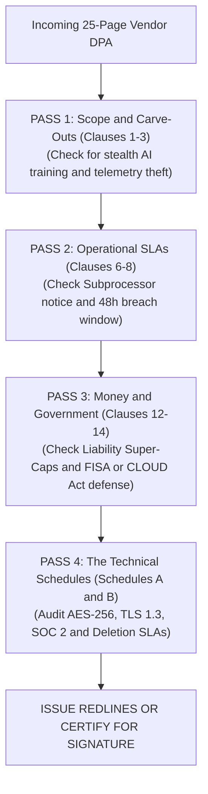

# 📘 HOW TO READ, AUDIT & NEGOTIATE A COMPLETE 25-PAGE ENTERPRISE DPA
### *The Senior Privacy Lawyer & TPRM Lead's Operational Review Handbook*
**Authoritative Operational Guide for Category 2 GRC & Privacy Engineering Professionals**  
**Location in Master Portfolio:** `C:\Users\acer\Privacy_Engineering_Master_Portfolio\08_REAL_WORLD_DPA_BENCHMARK_SAMPLES\GUIDE_HOW_TO_READ_AND_AUDIT_A_FULL_DPA.md`

---

## 🧭 Why Senior Privacy Professionals Do NOT Read Line-by-Line

When a 25-page Data Processing Addendum (DPA) lands on your desk, junior analysts often make the mistake of reading it like a novel from page 1 to page 25. This causes cognitive fatigue and causes them to miss the critical traps hidden in the definitions and schedules.

Senior Privacy Counsel, Data Protection Officers, and TPRM Leads use the **4-Pass Strategic Reading Methodology** to audit, score, and redline a complete enterprise DPA in **15 to 20 minutes**.

---

## 🔍 THE 4-PASS STRATEGIC AUDITING METHODOLOGY

---

### PASS 1: Scope, Roles & Stealth AI Carve-Outs (Clauses 1 – 3)
* **Time Allocation:** 4 Minutes  
* **Where to Look:** Clause 1 (Definitions), Clause 2 (Roles), and Clause 3 (Instructions & Purpose).

#### What to Hunt For:
1. **The Telemetry Carve-Out Trap:**
   * Look closely at the definition of *"Customer Data"* versus *"Service Data"*, *"Diagnostic Data"*, or *"System Telemetry"*.
   * *The Vendor Trap:* Vendors often insert: *"Customer Data does not include aggregated, anonymized, or system telemetry generated through the use of the Services, which Vendor may use for product improvement."*
   * *Your Action:* Strike this down or restrict it so that customer prompts, inputs, canvas content, and IP addresses can never be classified as "system telemetry".
2. **The Artificial Intelligence (AI) Training Trap:**
   * Search for the terms *"machine learning"*, *"artificial intelligence"*, *"train"*, or *"models"*.
   * *Your Action:* Ensure the DPA contains an **express warranty** that customer data will NOT be used to train vendor foundation LLMs (as drafted in Section 3.3 of our Master Specimen).
3. **The Role Allocation:**
   * Verify that Customer is strictly the **Data Controller / Data Fiduciary** and Vendor is strictly the **Data Processor**. If the vendor claims to be an "Independent Controller" for anything other than basic invoicing/tax billing, flag it immediately.

---

### PASS 2: Operational Timelines & SLAs (Clauses 6 – 8)
* **Time Allocation:** 4 Minutes  
* **Where to Look:** Subprocessors (Clause 6), DSAR (Clause 7), and Breach Notification (Clause 8).

#### What to Hunt For:
1. **Subprocessor Notification Window (Clause 6.3):**
   * *The Vendor Trap:* Vendors love specifying *"10 days notice"* or *"notice via our website"*.
   * *Your Action:* Demand **at least thirty (30) calendar days’ prior written notice** sent directly by email or automated RSS feed, plus an affirmative **Right to Terminate** without penalty if you object.
2. **Breach Notification SLA (Clause 8.1):**
   * *The Vendor Trap:* Vendors will write: *"Vendor shall notify Customer of a Security Incident without undue delay."*
   * *The Danger:* Under GDPR Article 33, **you only have 72 hours** to report to European regulators. If the vendor takes 60 hours, your DPO has only 12 hours left to investigate and file.
   * *Your Action:* Redline "undue delay" into **"within forty-eight (48) hours of becoming aware"**.
3. **Data Subject Rights Turnaround (Clause 7.3):**
   * Ensure the vendor commits to technical assistance within **5 to 10 business days** if self-service admin tools cannot purge user session data.

---

### PASS 3: The Financial & Government Shield (Clauses 11 – 14)
* **Time Allocation:** 4 Minutes  
* **Where to Look:** International Transfers (Clause 11), Government Demands (Clause 12), and Liability (Clause 14).

#### What to Hunt For:
1. **The Limitation of Liability Trap (The #1 Money Issue!):**
   * Check how the DPA connects to the Master Services Agreement (MSA).
   * *The Vendor Trap:* The vendor’s MSA will state: *"Total aggregate liability shall not exceed the fees paid by Customer in the 12 months preceding the claim."*
   * *The Danger:* If an AWS or SaaS leak causes a **₹250 Crore DPDPA fine** or a **€20 Million GDPR penalty**, a 12-month fee cap of $50,000 means the vendor walks away, and your company absorbs millions in losses!
   * *Your Action:* Demand a **"Super-Cap" (2x to 5x annual contract value)** specifically for data protection breaches and regulatory indemnification.
2. **The US CLOUD Act / FISA Section 702 Shield (Clause 12):**
   * For US-headquartered vendors (AWS, Google, Microsoft, Salesforce), verify they commit to:
     * (a) Notify you before disclosing data (unless legally gagged);
     * (b) **Challenge unlawful or overbroad government orders in court**; and
     * (c) Disclose the absolute minimum data required.

---

### PASS 4: The Technical Schedules (Schedules A & B)
* **Time Allocation:** 3 Minutes  
* **Where to Look:** Schedule A (Details of Processing) and Schedule B (TOMs).

#### What to Hunt For:
1. **Schedule A (RoPA Alignment):**
   * Verify that the listed categories of personal data match what you documented in your **Article 30 RoPA**!
2. **Schedule B (Technical Measures - TOMs):**
   * *The Vendor Trap:* Vendors using fluffy marketing words like *"industry-standard security safeguards"*.
   * *Your Action:* Ensure they explicitly commit to:
     * **TLS 1.3 / 1.2** in transit.
     * **AES-256** encryption at rest.
     * **Annual SOC 2 Type II** and **ISO 27001** third-party audit reports.
     * **Annual independent penetration tests**.
3. **Data Deletion Upon Termination (Clause 13):**
   * Confirm complete deletion within **30 days** (not 180 days), and demand an officer-signed **Certificate of Destruction under NIST SP 800-88**.

---

## 🌐 LIVE OFFICIAL REPOSITORIES OF GLOBAL ENTERPRISE DPAs

Every major tech enterprise maintains their full, signed DPA publicly accessible on their compliance trust portals. You can inspect the real, unedited contracts directly at these links:

| Enterprise | Official Trust / DPA Legal Portal URL | Key Document Name |
| :--- | :--- | :--- |
| **Amazon Web Services (AWS)** | [aws.amazon.com/compliance/dpa](https://aws.amazon.com/compliance/dpa/) | *AWS GDPR Data Processing Addendum* |
| **Microsoft Corporation** | [microsoft.com/licensing/terms](https://www.microsoft.com/licensing/terms/welcome/welcome-page) | *Microsoft Products and Services DPA (OST/DPA)* |
| **Google Cloud (GCP)** | [cloud.google.com/terms/data-processing-addendum](https://cloud.google.com/terms/data-processing-addendum) | *Google Cloud Data Processing Addendum (CDPA)* |
| **Salesforce** | [trust.salesforce.com](https://trust.salesforce.com/) & [salesforce.com/company/legal](https://www.salesforce.com/company/legal/agreements/) | *Salesforce Data Processing Addendum (with BCRs)* |
| **Stripe** | [stripe.com/legal/dpa](https://stripe.com/en-in/legal/dpa) | *Stripe Global Data Processing Agreement* |
| **Cloudflare** | [cloudflare.com/cloudflare-customer-dpa](https://www.cloudflare.com/cloudflare-customer-dpa/) | *Cloudflare Customer Data Processing Addendum* |
| **Atlassian** | [atlassian.com/legal/data-processing-addendum](https://www.atlassian.com/legal/data-processing-addendum) | *Atlassian Customer Data Processing Addendum* |
| **Freshworks** | [freshworks.com/data-processing-addendum](https://www.freshworks.com/data-processing-addendum/) | *Freshworks Global Data Processing Addendum* |
| **Zoho Corporation** | [zoho.com/privacy/dpa](https://www.zoho.com/privacy/dpa.html) | *Zoho Data Processing Addendum (Privacy-First)* |

---

## 🎯 THE 5-MINUTE INTERVIEW AUDITING SCRIPT

When an interviewer asks you: *"How do you review a 25-page vendor DPA?"*, deliver this structured answer:

> *"I don't read vendor contracts passively. I execute a 4-pass audit methodology:
> 
> In Pass 1, I inspect definitions to catch stealth carve-outs where the vendor tries to classify customer inputs as 'system telemetry' to train proprietary AI models.
> 
> In Pass 2, I audit the time-sensitive operational SLAs—ensuring we receive at least 30 days prior notice for new subprocessors and redlining 'undue delay' into a rigid 48-hour breach notification SLA so our DPO can meet the 72-hour GDPR Article 33 window.
> 
> In Pass 3, I address commercial risk—negotiating an enterprise Super-Cap for data protection breaches so potential fines under DPDPA (₹250 Cr) or GDPR (€20M) aren't swallowed by standard 12-month MSA liability limits, and verifying Schrems II commitments to challenge unlawful US CLOUD Act subpoenas.
> 
> Finally, in Pass 4, I cross-reference Schedule A against our Article 30 RoPA and verify that Schedule B explicitly mandates AES-256 encryption at rest, TLS 1.3, and certified media destruction under NIST SP 800-88 within 30 days of contract termination."*

This answer proves you are an elite, dual-domain professional who protects the company technically, commercially, and legally.
