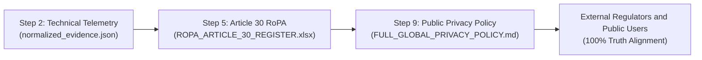

# 🛠️ HOW TO DRAFT A PRIVACY POLICY FROM A TECHNICAL RoPA
### *The Engineering Bridge: From Internal Register to External Notice*
**Authoritative Operational Guide for Privacy Engineers & GRC Analysts**  
**Location:** `C:\Users\acer\Privacy_Engineering_Master_Portfolio\09_PRIVACY_POLICIES_AND_TRANSPARENCY_GOVERNANCE\HOW_TO_DRAFT_A_PRIVACY_POLICY_FROM_ROPA.md`

---

## 🧭 The Core Principle: RoPA is the Source of Truth

A common mistake in junior GRC teams is copying and pasting a generic privacy policy from the internet. 

In enterprise privacy engineering, **you NEVER write a privacy policy from scratch**. You generate it directly from your **Article 30 Records of Processing Activities (RoPA)** register (which we built in **Step 5**):



---

## 🔄 THE RoPA-TO-PRIVACY-POLICY TRANSLATION MATRIX

Every column in your **Step 5 RoPA Excel Workbook** maps directly to a specific section of your public Privacy Policy:

| Column in RoPA (`.xlsx`) | Section in Privacy Policy (`.md`) | Practical Translation Example |
| :--- | :--- | :--- |
| **Activity Name & Purpose** | **Section 3: How We Use Your Data** | *"Digital Advertising & Retargeting"* becomes *"We use identifiers to deliver targeted advertisements across third-party websites."* |
| **Categories of Personal Data** | **Section 2: Data We Collect** | `Online identifiers (IDE, bcookie), IP, User-Agent` becomes *"We collect your device identifiers, IP addresses, and browsing telemetry."* |
| **Lawful Basis (GDPR Art. 6)** | **Section 3: Legal Grounds** | `Article 6(1)(a) Consent` becomes *"We rely on your prior affirmative consent obtained via our cookie banner."* |
| **Recipients & Subprocessors** | **Section 5: Third Parties We Share With** | `Google LLC, LinkedIn Corporation, Tapad Inc.` becomes *"We share information with advertising networks including Google and LinkedIn."* |
| **Cross-Border Transfers** | **Section 8: International Transfers** | `USA & Ireland; SCCs Module 2` becomes *"Your data is transferred to the US under European Commission Standard Contractual Clauses."* |
| **Retention Schedule** | **Section 9: Data Retention** | `Ad cookies: 90 days to 13 months` becomes *"Advertising cookies are retained for a maximum of 13 months."* |
| **Security TOMs (Art. 32)** | **Section 12: Security Safeguards** | `TLS 1.3, AES-256, SOC 2 Type II` becomes *"We enforce TLS 1.3 encryption in transit and AES-256 encryption at rest."* |

---

## 🚨 THE DANGER OF "DISCLOSURE GAPS" (What We Caught on Miro)

When technical reality diverges from your Privacy Policy, regulatory exposure is immediate:

```
┌─────────────────────────────────┬─────────────────────────────────┬─────────────────────────────────┐
│ Technical Reality (Telemetry)   │ Privacy Policy Stated           │ Statutory Violation Triggered   │
├─────────────────────────────────┼─────────────────────────────────┼─────────────────────────────────┤
│ Microsoft Clarity session screen│ Completely omitted from policy  │ GDPR Art. 13(1)(e) Violation;   │
│ replay active (`c.clarity.ms`)  │ and subprocessor list.          │ DPDPA Sec. 5 Notice failure.    │
├─────────────────────────────────┼─────────────────────────────────┼─────────────────────────────────┤
│ Tapad 3-Way Device Sync active  │ Undisclosed third-party sync.   │ CCPA § 1798.120 failure to      │
│ (`TapAd_3WAY_SYNCS`)            │                                 │ disclose "Sale/Sharing".        │
├─────────────────────────────────┼─────────────────────────────────┼─────────────────────────────────┤
│ Hotjar heatmaps firing          │ Claims all non-essential cookies│ ePrivacy Directive Art. 5(3)    │
│ Pre-Consent in `baseline.json`  │ require prior consent.          │ False and deceptive claim.      │
└─────────────────────────────────┴─────────────────────────────────┴─────────────────────────────────┘
```

---

## 🎯 INTERVIEW SPEAKING SCRIPT

When an interviewer asks: *"How do you ensure our public privacy notice remains accurate as engineers push new features?"*, answer:

> *"I maintain an automated continuous bridge between engineering telemetry and legal governance. 
> 
> When our technical telemetry audits detect new scripts—like Microsoft Clarity or Tapad—we first map them into our candidate processing activities, validate them in our Article 30 RoPA register, and then update our public Privacy Policy. 
> 
> We never treat privacy policies as static legal documents; they must directly reflect the live network packet reality of our production codebase to prevent regulatory transparency sanctions under GDPR Article 13 and Indian DPDPA Section 5."*
