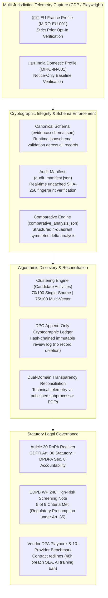

# 🛡️ Enterprise Privacy Engineering & Dual-Domain Telemetry GRC Platform

> **An Empirical Privacy Engineering & Comparative Telemetry GRC Platform Harmonizing Client-Side Telemetry with Global Privacy Frameworks (EU GDPR, India DPDPA 2023, and US CCPA/CPRA).**

[](#-regulatory--statutory-alignment)
[](#-step-5-statutory-article-30-ropa-register)
[-critical.svg)](#-step-6-high-risk-dpia-threshold-assessment)
[](#-step-2-live-digital-telemetry--consent-gate-audit)
[](LICENSE)

---

## Executive Summary

Modern enterprise web platforms deploy sophisticated Consent Management Platforms (CMPs) that dynamically adjust their consent interfaces, cookie storage, and tracking scripts depending on the visitor's geographic location. Evaluating client-side compliance without accounting for this regional variability produces flawed audits—either misapplying EU GDPR standards to non-EU traffic, or overlooking cross-border divergences in data protection controls.

The **Enterprise Privacy Engineering & Dual-Domain Telemetry GRC Platform** bridges technical browser DevTools Protocol (CDP) telemetry with statutory legal compliance. The platform features an empirical **Dual-Jurisdiction Comparative Engine** contrasting real-world telemetry captured under a **European Union benchmark condition (France)** against an **Indian domestic baseline condition**.

---

### Core Empirical Finding: Jurisdiction-Dependent Consent Configuration Observed

Across controlled, clean-slate Chromium sessions on the audited production platform (`https://miro.com`), the web platform exhibited materially divergent consent-management and client-side telemetry behavior based on detected visitor geography:

```
                                  Target: miro.com
                                         │
                 ┌───────────────────────┴───────────────────────┐
                 ▼                                               ▼
         🇪🇺 MIRO-EU-001                                  🇮🇳 MIRO-IN-001
      France / Île-de-France                          India / Delhi Baseline
     OneTrust Strict Prior Opt-In                    OneTrust Notice / Opt-Out Style
                 │                                               │
    ├─ Active Groups: ,C0001,                       ├─ Active Groups: ,C0001,C0003,C0002,C0004,
    ├─ Pre-Consent Cookies: 9                       ├─ Pre-Consent Cookies: 55
    ├─ Pre-Consent Ad Trackers: 0                   ├─ Pre-Consent Ad Trackers: 3 Firing (Clarity, Tapad)
    ├─ First-Layer Reject All: "Tout refuser"       ├─ First-Layer Reject All: OMITTED (Notice-only)
    ├─ Post-Reject: 10 cookies (Clean State)        ├─ Post-Reject: Unavailable on Layer 1
    └─ Post-Accept: 53 cookies (Gated Release)      └─ Post-Accept: 65 cookies (DoubleClick IDE Released)
```

---

### Key Comparative Metrics (Audited Platform: Miro Enterprise)

| Forensic Dimension | 🇪🇺 European Union Route (`MIRO-EU-001`) | 🇮🇳 India Route (`MIRO-IN-001`) | Technical & Governance Assessment |
| :--- | :--- | :--- | :--- |
| **Observed GeoIP** | `FR / IDF` (`Europe/Paris`) via proxy | `IN / DL` (`Asia/Kolkata`) direct IP | Intercepted OneTrust GeoIP endpoint (`geolocation.onetrust.com`). |
| **CMP Active Groups** | `window.OnetrustActiveGroups = ",C0001,"` | `window.OnetrustActiveGroups = ",C0001,C0003,C0002,C0004,"` | Prior opt-in enforced on EU route; notice/opt-out configuration on domestic route. |
| **First-Layer Banner UX** | Equal prominence: **"Tout refuser"** alongside **"Autoriser"** | Notice banner: **"Accept all cookies"**; NO **"Reject All"** on first layer | Asymmetric choice architecture in India under Consumer Protection (Dark Patterns) Guidelines 2023 scrutiny. |
| **Pre-Consent Cookies** | **9 Cookies** *(Category C0001 active; classification under review)* | **55 Cookies** *(Marketing, analytics & cross-site trackers deposited on load)* | **-83.6% data minimization** observed on European route relative to domestic baseline. |
| **Pre-Consent Ad Trackers** | **0 Trackers Fired** *(Clarity, Tapad, DoubleClick withheld)* | **Active Trackers Firing** *(Microsoft Clarity, Tapad, Hotjar transmit immediately)* | EU ePrivacy Directive Art. 5(3) prior consent gate bypassed on domestic route. |
| **Post-Reject State** | **10 Cookies** *(Clean rejection preserved; +1 preference cookie)* | **N/A** *(Requires secondary modal navigation / manual opt-out)* | Proves one-click rejection control is operational in EU but omitted on Indian landing layer. |
| **Post-Accept State** | **53 Cookies** *(Affirmative consent releases analytics/ad cookies)* | **65 Cookies** *(Affirmative click releases gated Google DoubleClick IDE)* | Demonstrates conditional script-blocking works, but is dynamically relaxed on domestic route. |
| **Applicable Law** | **GDPR Arts. 4(11), 7(3) & ePrivacy Dir.** *(Enforceable today)* | **DPDPA 2023 §6** *(Phased commencement)* & **CPA 2019** | Prospective DPDPA risk once Section 6 phased commencement schedule completes. |

---

## End-to-End Governance Architecture



---

## Detailed Step-by-Step Methodology

### 📐 Step 1: Canonical Audit Schema ([`evidence.schema.json`](file:///C:/Users/acer/Privacy_Engineering_Master_Portfolio/01_STEP1_CANONICAL_SCHEMA/evidence.schema.json))
- **Mathematical Specification:** Defines strict JSON schema constraints for all ingested evidence records, including `audit_run_id`, `jurisdiction` (`INDIA`, `EU`, `US`), `applicable_framework` (`GDPR`, `DPDPA`), and `geo_context`.
- **Runtime Enforcement:** In [`app.py`](file:///C:/Users/acer/Privacy_Engineering_Master_Portfolio/app.py), `jsonschema.validate()` validates every evidence record upon loading.

### 🌐 Step 2: Standardized Multi-Jurisdiction Capture CLI ([`capture_miro.py`](file:///C:/Users/acer/Privacy_Engineering_Master_Portfolio/capture_miro.py))
- **Reproducible Instrumentation:** Playwright Chromium script supporting both regional profiles:
  ```bash
  # Run European Union Strict Opt-In Benchmark (France Proxy)
  python capture_miro.py --profile eu-france --proxy http://127.0.0.1:61809

  # Run India Domestic Baseline
  python capture_miro.py --profile india
  ```
- **Observed Captures:** Records OneTrust GeoIP response, DOM-level `window.OnetrustActiveGroups`, full HTTP Archive (HAR), pre-consent cookies, and post-action cookies (Accept All vs. Reject All).

### 🧩 Step 3: Algorithmic Discovery & Append-Only DPO Governance
- **Algorithmic Support Index:**
  - **70/100 (Single-Source):** Inferred from a single technical layer (e.g., HTTP Network Traffic only).
  - **75/100 (Multi-Vector Corroboration):** Corroborated across multiple independent layers (e.g., active CDP network beacon *and* persistent DOM cookie storage).
  - **Machine Ceiling (<80/100):** Software alone cannot declare legal lawful bases or business intent. Algorithmic scores are capped below 80 to mandate human legal review.
- **Append-Only Event Ledger ([`dpo_signoff_log.json`](file:///C:/Users/acer/Privacy_Engineering_Master_Portfolio/03_STEP3_CANDIDATE_ACTIVITIES/dpo_signoff_log.json)):**
  - Uses an immutable, cryptographically chained event log (`SIGNOFF_RECORDED`, `SIGNOFF_REVOKED`).
  - Never mutates or deletes historical sign-off records; active state is derived chronologically.
  - Human validation adds `dpo_review_status = APPROVED` without falsely inflating the technical support score.

### 🔍 Step 4: Dual-Domain Discrepancy & Transparency Reconciliation
- **Ground Truth vs. Public Disclosures:** Cross-references observed network destinations against Miro's public Subprocessor List PDF (July 2026).
- **Discovered Shadow Telemetry:** Identified unlisted third-party trackers including **Microsoft Clarity** (`CLID`, `SM`, `MUID`), **Tapad Inc.** (`TapAd_3WAY_SYNCS`), and **Hotjar** actively communicating with external infrastructure.

### 🏛️ Step 5: Multi-Jurisdictional RoPA Register ([`ROPA_ARTICLE_30_REGISTER.md`](file:///C:/Users/acer/Privacy_Engineering_Master_Portfolio/04_STEP4_TRANSPARENCY_AND_COOKIE_REGISTER/ROPA_ARTICLE_30_REGISTER.md))
- **GDPR Article 30:** Statutory Record of Processing Activities for Data Controllers.
- **Indian DPDPA 2023 Alignment:** Clarifies that while DPDPA does not establish a statutory RoPA requirement, maintaining an internal processing inventory is an operational fiduciary best practice under Section 8 accountability duties.

### 🛡️ Step 6: High-Risk DPIA Threshold Assessment ([`DPIA_SCREENING_NOTE.md`](file:///C:/Users/acer/Privacy_Engineering_Master_Portfolio/06_STEP6_DPIA_SCREENING_NOTE/DPIA_SCREENING_NOTE.md))
- **EDPB Guidelines WP 248 rev.01:** Evaluates live telemetry against the 9 supervisory criteria.
- **5 of 9 Criteria Met:** Systematic monitoring (Clarity DOM replay), profiling (Tapad cross-device syncing), large-scale processing, dataset combination, and innovative technology.
- **Regulatory Verdict:** Triggers a strong regulatory presumption in supervisory guidance warranting a formal Data Protection Impact Assessment under GDPR Article 35(1).

### 📑 Step 7: Vendor DPA Contract Redline Playbook & 10-Provider Benchmark
- **7 Battleground Contract Redlines:** 48-hour breach notification SLA, strict AI model training prohibition, 30-day subprocessor veto window, and direct audit rights.
- **Cross-Industry Scorecard:** 10-point comparative analysis across AWS, GCP, Azure, Salesforce, Atlassian, Stripe, HubSpot, Cloudflare, Freshworks, and Zoho.

---

## 🏛️ Statutory Alignment Summary

| Statute / Instrument | Specific Section | Governance Application |
| :--- | :--- | :--- |
| **EU GDPR** | **Arts. 4(11), 7(3)** (Valid Consent) | Verified against European benchmark route; evaluated pre-consent gating. |
| **EU ePrivacy Directive** | **Art. 5(3)** (Terminal Storage Access) | Enforces prior opt-in for non-essential client-side cookies and DOM storage. |
| **EU GDPR** | **Art. 30** (Records of Processing Activities) | Multi-sheet controller inventory with lawful bases, retention rules, and TOMs. |
| **EU GDPR** | **Art. 35(1)** (High-Risk DPIA Screening) | Screened against EDPB WP 248 9-criteria matrix; 5 factors triggered. |
| **EU GDPR** | **Art. 28** (Processor Contract Terms) | Standardized DPA redline playbook with mandatory audit and breach SLAs. |
| **India DPDPA 2023** | **Sec. 6** (Notice & Consent Mandates) | Evaluated prospective compliance for domestic route under phased commencement. |
| **India DPDPA 2023** | **Sec. 8** (Fiduciary Accountability) | Operational processing inventory maintained as organizational governance practice. |
| **Consumer Protection Act 2019** | **Dark Patterns Guidelines 2023** | Scrutinizes omission of first-layer "Reject All" as asymmetric choice architecture. |
| **US CCPA / CPRA** | **Cal. Civ. Code § 1798.135** | Identifies cross-context behavioral ad trackers triggering opt-out disclosures. |

---

## 🚀 Running the Platform

### Prerequisites
* Python 3.10+
* Google Chrome / Chromium installed via Playwright

### Installation
```bash
git clone https://github.com/tbinitial-cyber/Privacy-Engineering-GRC-Platform.git
cd Privacy-Engineering-GRC-Platform
pip install -r requirements.lock
playwright install chromium
```

### Launch Interactive Executive Portal
```bash
streamlit run app.py
```

### Reproduce Empirical Audit Captures
```bash
# Capture European Union Strict Opt-In Benchmark (requires EU proxy on port 61809)
python capture_miro.py --profile eu-france --proxy http://127.0.0.1:61809

# Capture Indian Domestic Baseline
python capture_miro.py --profile india
```

---

## License
MIT License. Created for enterprise privacy engineering, technical GRC research, and regulatory compliance validation.
