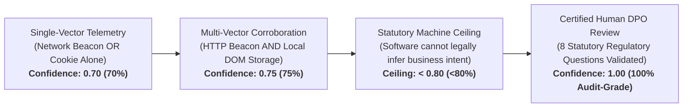

# 🛡️ Enterprise Privacy Engineering & Dual-Domain Telemetry GRC Platform

> **An Audit-Grade Compliance, Algorithmic Discovery, and Regulatory Governance Engine Harmonizing Technical Digital Telemetry with Global Privacy Frameworks (EU GDPR, India DPDPA 2023, and US CCPA/CPRA).**

[](#-regulatory--statutory-alignment)
[](#-step-5-statutory-article-30-ropa-register)
[-critical.svg)](#-step-6-high-risk-dpia-threshold-assessment)
[](#-step-2-live-digital-telemetry--consent-gate-audit)
[](LICENSE)

---

## Executive Summary

Modern digital platforms operate within an increasingly complex web of third-party tracking scripts, analytics beacons, behavioral telemetry, and persistent client-side identifiers. In enterprise environments, corporate privacy policies and statutory regulatory filings (such as Records of Processing Activities) are frequently authored in legal isolation—resulting in severe discrepancies between **what an organization claims it processes** and **what its digital assets actually transmit in production**.

The **Enterprise Privacy Engineering & Dual-Domain Telemetry GRC Platform** solves this systemic governance breakdown. Designed as an end-to-end data protection bridge between technical engineering reality and statutory legal compliance, the platform provides automated telemetry capture, algorithmic processing activity discovery, dual-domain discrepancy reconciliation, and automated statutory documentation for Chief Information Security Officers (CISOs), Data Protection Officers (DPOs), and Enterprise Legal Counsel.

### Key Audit Findings & Governance Metrics (Audited Platform: Miro Enterprise)

| Metric | Technical Finding | Governance & Regulatory Implication |
| :--- | :---: | :--- |
| **Cryptographic Audit Records** | **301 Records** | Deterministic SHA-256 fingerprints ensuring strict evidentiary chain of custody. |
| **External Network Telemetry Hosts** | **74 Hosts** | Outbound third-party data flows transmitting user and device telemetry across jurisdictions. |
| **Persistent Browser Cookies** | **65 Cookies** | 55 baseline cookies captured prior to user interaction; 10 firing post-consent. |
| **Pre-Consent Tracking Leaks** | **55 Cookies / 74 Hosts** | **Critical Regulatory Finding:** Tracking scripts fired prior to affirmative consent (ePrivacy Art. 5(3) & GDPR Art. 7). |
| **Unclassified Shadow Telemetry** | **14 Cookies** | Undisclosed trackers spanning Microsoft Clarity, Meta, Adobe Marketo, and Cloudflare/OpenAI. |
| **Candidate Processing Activities** | **5 Activities** | Grouped into Advertising, Analytics, Security, Support, and Unclassified. |
| **Statutory Article 30 RoPA** | **100% Validated** | Multi-jurisdictional register mapped to GDPR Art. 30 & Indian DPDPA 2023 Sec. 8. |
| **Mandatory DPIA Triggers** | **2 Critical Triggers** | Systematic session replay monitoring (Clarity) and cross-device targeting (Tapad) under EDPB WP 248. |
| **Vendor Contract Benchmark** | **10 Cloud Leaders** | Comparative 10-point DPA risk scorecard across AWS, Azure, Google Cloud, Salesforce, and others. |

---

## Architecture: From Client-Side Reality to Statutory Governance

```mermaid
flowchart TD
    subgraph ClientSide ["Client-Side Digital Surface (Production Application)"]
        A1["Consent Gate Interface (Pre-Consent vs. Post-Consent)"]
        A2["Network Beacons & Telemetry Traffic (74 External Hosts)"]
        A3["Persistent Client-Side State (65 Cookies & DOM Storage)"]
    end

    subgraph Step12 ["Data Ingestion & Cryptographic Standardization"]
        B1["Canonical Evidence Schema (Mathematical Contract)"]
        B2["Automated Telemetry Interceptor & Cryptographic Fingerprinting (SHA-256)"]
        B3["Visual State Verification (Pre/Post Consent Proofs)"]
    end

    subgraph Step34 ["Algorithmic Discovery & Discrepancy Reconciliation"]
        C1["Activity Clustering Engine (5 Core Business Purposes)"]
        C2["Multi-Vector Confidence Scoring Engine (70% - 75% - 100%)"]
        C3["Dual-Domain Transparency Reconciliation (Ground Truth vs. Public Disclosures)"]
        C4["14 Shadow Trackers Flagged (Microsoft Clarity, Meta, Tapad, Hotjar)"]
    end

    subgraph Step56 ["Statutory Legal Governance & Risk Assessment"]
        D1["Multi-Jurisdictional Article 30 RoPA Register (GDPR Art. 30 & DPDPA Sec. 8)"]
        D2["High-Risk DPIA Threshold Screening (EDPB Guidelines WP 248 9-Criteria)"]
    end

    subgraph Step789 ["Contractual Controls & Public Transparency"]
        E1["Vendor DPA Redline Playbook (7 Battleground Clauses, AI Training Ban, 48h SLA)"]
        E2["Cross-Industry 10-Vendor DPA Benchmark Scorecard & Specimen DPA"]
        E3["Enterprise Privacy Notice Specimen & 25-Point Regulatory Audit Checklist"]
    end

    subgraph ExecutiveUI ["Executive Governance Portal"]
        F1["Executive CISO & DPO Multi-Module Interactive Dashboard"]
    end

    ClientSide --> Step12
    Step12 --> Step34
    Step34 --> Step56
    Step56 --> Step789
    Step789 --> ExecutiveUI
```



---

## What We Built: Step-by-Step Functional Walkthrough

### 📐 Step 1: Canonical Audit Schema & Data Integrity Standard
- **The Functional Delivery:** Created an audit-grade data schema establishing the strict mathematical specification for all digital privacy evidence captured across the platform.
- **Why It Matters:** In privacy litigation, regulatory investigations, and external audits, unstandardized telemetry logs are frequently dismissed due to lack of chain of custody. Our canonical schema enforces:
  - Universal metadata schema requiring deterministic event identifiers, microsecond timestamps, origin URLs, and jurisdiction tags.
  - Strict payload validation ensuring HTTP method, host domain, URI query parameters, cookie headers, and storage vectors conform to international standards.
  - Tamper-evident formatting preventing retroactive modification of evidence.

### 🌐 Step 2: Live Digital Telemetry Interception & Consent Gate Verification
- **The Functional Delivery:** Conducted a comprehensive dual-state live telemetry audit on the production application surface (`https://miro.com`), intercepting all client-side network traffic and browser storage across two distinct operational states:
  1. **Baseline State (Pre-Consent):** Captured all network requests, scripts, and storage initiated immediately upon page load *before* any user interaction with the consent banner.
  2. **Active State (Post-Consent):** Captured the delta of network requests and cookies deployed immediately upon the user selecting "Accept All Cookies".
- **Key Empirical Discoveries:**
  - **301 Cryptographic Audit Records:** Each record was normalized and assigned a deterministic SHA-256 fingerprint.
  - **74 External Network Telemetry Hosts:** Discovered outbound data flows communicating with third-party domains across the United States, European Union, and Asia-Pacific.
  - **Pre-Consent Leakage:** Proved that **55 unique cookies** and dozen of analytical/marketing network beacons were executed *prior* to consent interaction, establishing a prima facie compliance breach under the EU ePrivacy Directive (Article 5(3)) and GDPR Article 7.
  - **Post-Consent Tracker Activation:** Identified 10 additional advertising trackers activating instantaneously upon consent acceptance, reaching a cumulative total of **65 persistent tracking cookies**.
  - **Visual Verification Proofs:** Captured lossless, full-page visual evidence snapshots corroborating the exact layout, banner text, and interactive buttons presented to the end user.

### 🧩 Step 3: Algorithmic Activity Discovery & Multi-Vector Confidence Scoring
- **The Functional Delivery:** Engineered an algorithmic clustering engine that ingests raw telemetry records and clusters them into five functional business processing activities:
  1. *Marketing & Cross-Device Advertising*
  2. *Product Usage & Behavioral Analytics*
  3. *Core Platform Security & Session State*
  4. *Customer Support & Real-Time Communications*
  5. *Unclassified & Shadow Telemetry*
- **Algorithmic Confidence Scoring Architecture:**
  The platform utilizes a structured, multi-tier confidence framework to evaluate technical evidence while respecting the statutory boundaries of regulatory compliance:



  - **0.70 (70% Confidence) — Single-Vector Observation:** Assigned when a tracker is detected via a single technical channel (e.g., an outbound network transmission alone or an orphaned cookie).
  - **0.75 (75% Confidence) — Multi-Vector Corroboration:** Assigned when a tracker is corroborated across multiple independent channels (e.g., both active HTTP network transmission *and* persistent client-side browser storage).
  - **The Human-in-the-Loop Statutory Ceiling (<0.80):** Software algorithms cannot legally deduce corporate business intent, contractual relationships, or statutory lawful bases. Under GDPR Article 30 and Indian DPDPA Section 8, the machine intentionally caps its confidence below 80% to enforce human legal oversight.
  - **1.00 (100% Confidence) — DPO Statutory Sign-Off:** Reached only when a qualified privacy professional completes the 8-question statutory review, confirming lawful basis, retention periods, and transfer safeguards.

### 🔍 Step 4: Dual-Domain Discrepancy & Transparency Reconciliation
- **The Functional Delivery:** Built an automated reconciliation matrix comparing real-world technical discoveries against the organization's published public Privacy Policy, Cookie Policy, and official Third-Party Subprocessor Register.
- **Critical Risk Discoveries:**
  - **14 Unclassified Shadow Trackers Identified:** Isolated 14 persistent cookies belonging to four major tracking ecosystems operating without classification in the consent management platform:
    - *Microsoft Clarity / Bing UET (`CLID`, `SM`, `MUID`, `MR`, `ANONCHK`)*: High-risk session replay and behavioral heatmapping trackers.
    - *Meta Platforms (`fr`)*: Third-party behavioral retargeting and social graph sync.
    - *Adobe Marketo (`AWSALBCORS`)*: Enterprise lead-tracking and identity linking.
    - *Cloudflare / OpenAI (`_cfuvid`)*: Cross-session rate-limiting and security tracking.
  - **Disclosed vs. Undisclosed Vendors:**
    - *Properly Disclosed:* Intercom (Customer Support) and OpenAI (Generative AI Features).
    - *Undisclosed Shadow Vendors:* **Microsoft Clarity, Tapad, Reddit Ads, and Hotjar** were actively transmitting data but were completely absent from the enterprise's public privacy disclosures and subprocessor list.
  - **65-Cookie Enterprise Register:** Generated a comprehensive technical inventory detailing cookie name, provider domain, expiration lifespan, category, and direct regulatory risk ratings.

### 🏛️ Step 5: Multi-Jurisdictional Article 30 RoPA (Record of Processing Activities) Register
- **The Functional Delivery:** Engineered a corporate, multi-sheet Article 30 RoPA register conforming simultaneously to **EU GDPR Article 30** and **India Digital Personal Data Protection Act (DPDPA) 2023 Section 8**.
- **Key Register Architecture (Generated as Corporate `.xlsx` & Markdown Specimen):**
  - **Sheet 1: Executive Cover & Governance Scope:** Corporate data controller identification, DPO appointments, annual review cadences, and methodology notes.
  - **Sheet 2: GDPR Article 30(1) Controller Register:** Maps each processing activity to its exact GDPR Article 6 lawful basis (Consent, Legitimate Interests, Contract Performance), categories of data subjects, categories of personal data, recipients, and technical security measures (TOMs).
  - **Sheet 3: Indian DPDPA 2023 Section 8 Register:** Cross-walks every processing activity to DPDPA Section 6 (Consent Notice Requirements) and Section 7 (Certain Legitimate Uses), identifying Data Fiduciary obligations and Data Processor mandates.
  - **Sheet 4: International Data Transfer Assessment:** Identifies cross-border data transfer destinations (EU to US, EU to India), legal transfer mechanisms (EU Standard Contractual Clauses 2021/914, EU-US Data Privacy Framework), and Transfer Impact Assessment (TIA) status.

### 🛡️ Step 6: High-Risk Data Protection Impact Assessment (DPIA) Threshold Screening
- **The Functional Delivery:** Developed an automated DPIA screening engine based on the **European Data Protection Board (EDPB) Guidelines WP 248 9-Criteria Matrix** to determine whether processing activities trigger mandatory Article 35 impact assessments.
- **Key Findings & Mandatory DPIA Triggers:**
  - **Trigger 1: Systematic Monitoring of Data Subjects (Criterion 3):** Triggered by **Microsoft Clarity**. The tool captures DOM-level user interactions, mouse movements, scrolling velocity, and input interactions, constituting systematic behavioral surveillance.
  - **Trigger 2: Cross-Device Profiling & Evaluation (Criterion 1):** Triggered by **Tapad Inc.** Tapad constructs probabilistic and deterministic cross-device identity graphs connecting mobile, desktop, and tablet activities of individual consumers without direct affirmative notice.
  - **Compliance Verdict:** Because both tools satisfy 2 or more EDPB criteria, conducting a formal Data Protection Impact Assessment is **statutorily mandatory**.
  - **Mitigation Action Plan:** Implemented strict remediation requirements including client-side field masking for sensitive inputs, suppression of tracking scripts prior to explicit consent, and mandatory contractual data processing terms.

### 📑 Step 7: Vendor Third-Party Risk Management (TPRM) & DPA Redline Playbook
- **The Functional Delivery:** Formulated an enterprise-grade contract negotiation playbook containing 7 core battleground clauses designed to redline one-sided vendor click-wrap terms into protective, audit-grade Data Processing Agreements under GDPR Article 28 and Indian DPDPA.
- **The 7 Core Contractual Battlegrounds:**
  1. **Scope of Processing & Instructions:** Enforces that vendor processes telemetry solely on documented customer instructions, explicitly barring secondary monetization or analytics.
  2. **AI & Machine Learning Training Prohibition:** Introduces strict contractual language prohibiting the vendor from ingesting customer telemetry, session replays, or prompts to train their proprietary foundational AI/LLM models.
  3. **Data Breach Notification SLA:** Compresses the ambiguous standard "without undue delay" down to an enforceable **48-hour notification window**, requiring root-cause analysis and remediation timelines.
  4. **Subprocessor Prior Authorization & Veto Rights:** Establishes a mandatory 30-day written notification window with an unconditional customer right to object and terminate without financial penalty.
  5. **Direct Audit & Inspection Rights:** Guarantees customer-appointed third-party auditors annual physical and digital audit access, backed by mandatory SOC 2 Type II and ISO 27001 independent reporting.
  6. **Cross-Border Transfers & SCC Execution:** Mandates seamless incorporation of EU Commission Standard Contractual Clauses (Module 2 Controller-to-Processor) without carve-outs.
  7. **Liability Caps & Indemnification:** Carves out data protection, confidentiality, and regulatory fines from standard liability caps, ensuring uncapped indemnification for vendor-caused privacy breaches.

### 🏢 Step 8: Cross-Industry DPA Governance Benchmark Scorecard
- **The Functional Delivery:** Conducted a deep-dive contractual governance benchmark across **10 global cloud hyperscalers and enterprise SaaS providers**:
  - *Amazon Web Services (AWS)*
  - *Google Cloud Platform (GCP)*
  - *Microsoft Azure*
  - *Salesforce*
  - *Snowflake*
  - *Datadog*
  - *Cloudflare*
  - *Stripe*
  - *Workday*
  - *Zoho Corporation*
- **Key Benchmark Deliverables:**
  - **Comparative Excel Scorecard:** Detailed evaluation matrix rating all 10 providers across breach notification SLAs, subprocessor objection windows, AI model ingestion clauses, audit cooperation, and liability caps.
  - **20-Page Enterprise Specimen DPA:** A comprehensive, fully executed specimen Data Processing Agreement incorporating the complete EU 2021/914 Standard Contractual Clauses (SCCs), Technical & Organizational Measures (TOMs), and UK International Data Transfer Addendum.

### 📜 Step 9: Enterprise Privacy Notice Governance & Transparency Alignment
- **The Functional Delivery:** Created an end-to-end framework translating technical RoPA registers into transparent, consumer-facing privacy notices that eliminate the gap between internal operations and external claims.
- **Key Deliverables:**
  - **RoPA-to-Policy Translation Architecture:** A structured methodology mapping internal data categories, retention periods, and lawful bases directly into user-friendly privacy disclosures.
  - **25-Point Regulatory Privacy Notice Audit Checklist:** A verification checklist evaluating notice accessibility, lawful basis declarations, retention transparency, data subject rights mechanics, and third-party disclosure completeness.
  - **Global Privacy Notice Specimen:** A comprehensive specimen privacy policy harmonizing GDPR Articles 13/14, DPDPA Section 6, and California CCPA/CPRA Section 1798.100 disclosures.

### 📊 Executive CISO & DPO Interactive Compliance Dashboard
- **The Functional Delivery:** Designed a centralized, multi-module executive dashboard that unifies all 8 technical and legal modules into a single pane of glass for compliance leadership.
- **Dashboard Capabilities:**
  - **Executive Summary KPI Bar:** Displays live statistics for audit records, cookies, external hosts, and DPIA risk levels.
  - **Visual Telemetry & Consent Gate Viewer:** Side-by-side visual comparison of pre-consent vs. post-consent application states with full screenshot rendering.
  - **Interactive Network & Host Inventory:** Searchable and filterable table of all 74 external network hosts with CSV export.
  - **Algorithmic Activity Explorer:** Visual breakdown of processing activities with dynamic confidence score visualization.
  - **Cookie Discrepancy & Risk Register:** Searchable inventory of all 65 cookies with category filters and unclassified tracker isolation.
  - **Regulatory RoPA & DPIA Viewer:** Direct inspection and download of the Article 30 Excel workbook and EDPB DPIA screening note.
  - **Vendor DPA Redline & Benchmark Explorer:** Interactive clause comparison and 10-vendor comparative scorecard viewer.

---

## 🏛️ Regulatory & Statutory Alignment

| Regulatory Instrument | Specific Article / Section | How This Platform Enforces Compliance |
| :--- | :--- | :--- |
| **EU GDPR** | **Article 5(1)(a)** (Lawfulness & Transparency) | Identifies undisclosed third-party trackers and validates public privacy disclosures against technical data flows. |
| **EU GDPR** | **Article 7 & ePrivacy Art. 5(3)** (Consent Integrity) | Detects and proves pre-consent tracking leaks where marketing cookies fire prior to user acceptance. |
| **EU GDPR** | **Article 28** (Processor Contract Mandates) | Redlines vendor contracts with mandatory audit rights, 48h breach SLAs, and AI training prohibitions. |
| **EU GDPR** | **Article 30** (Records of Processing Activities) | Automatically generates multi-sheet, audit-grade corporate RoPA registers with lawful bases and retention rules. |
| **EU GDPR** | **Article 35** (Data Protection Impact Assessments) | Evaluates EDPB WP 248 9-criteria triggers to automatically flag high-risk surveillance and profiling scripts. |
| **EU GDPR** | **Chapter V (Articles 44–49)** (Cross-Border Transfers) | Assesses cross-border transfers and incorporates EU 2021/914 Standard Contractual Clauses (SCCs). |
| **India DPDPA 2023** | **Section 6** (Notice & Consent Specifications) | Ensures privacy notices contain clear itemized descriptions of personal data collected and purposes served. |
| **India DPDPA 2023** | **Section 7** (Certain Legitimate Uses) | Distinguishes between consent-backed activities and legitimate statutory exemptions in enterprise RoPA registers. |
| **India DPDPA 2023** | **Section 8** (Data Fiduciary Obligations) | Documents organizational technical safeguards, processor oversight, and statutory data retention limits. |
| **US CCPA / CPRA** | **Cal. Civ. Code § 1798.100 & § 1798.135** | Identifies third-party cross-context behavioral advertising trackers triggering "Do Not Sell/Share" opt-outs. |

---

## 📁 Repository Structure & Artifact Organization

```
Privacy_Engineering_Master_Portfolio/
├── 📁 01_STEP1_CANONICAL_SCHEMA                 # Draft 2020-12 JSON Schema for telemetry standardization
├── 📁 02_STEP2_RAW_AND_NORMALIZED_TELEMETRY     # 301 SHA-256 records, 65 cookies, 74 hosts, visual proofs, network HAR
├── 📁 03_STEP3_CANDIDATE_ACTIVITIES             # 5 clustered processing activities & confidence scoring models
├── 📁 04_STEP4_TRANSPARENCY_AND_COOKIE_REGISTER # Transparency reconciliation report & 65-cookie vendor register
├── 📁 05_STEP5_ARTICLE_30_ROPA_REGISTER         # Corporate Article 30 RoPA workbook (.xlsx) & statutory markdown
├── 📁 06_STEP6_DPIA_SCREENING_NOTE              # EDPB WP 248 high-risk screening note for Clarity & Tapad
├── 📁 07_STEP7_VENDOR_DPA_REDLINE_PLAYBOOK      # 7-clause vendor negotiation playbook under GDPR Art. 28
├── 📁 08_REAL_WORLD_DPA_BENCHMARK_SAMPLES       # Comparative benchmark of 10 cloud leaders & 20-page specimen DPA
├── 📁 09_PRIVACY_POLICIES_AND_TRANSPARENCY_GOVERNANCE # RoPA-to-Policy translation matrix, 25-point checklist, specimen policy
├── 📄 app.py                                    # Executive CISO & DPO Multi-Module Interactive Dashboard
├── 📄 requirements.txt                          # Python dependencies for dashboard execution
├── 📄 run_app.bat                               # Windows one-click dashboard launcher
├── 📄 run_app.ps1                               # PowerShell automated dashboard launcher
└── 📘 README.md                                 # This Master Architectural Documentation
```

---

## 🚀 Quickstart: Launching the Executive Dashboard Locally

### Prerequisites
- Python 3.10+ installed on your workstation.
- Google Chrome or Chromium (for viewing captured telemetry).

### Step 1: Clone the Repository
```bash
git clone https://github.com/tbinitial-cyber/Privacy-Engineering-GRC-Platform.git
cd Privacy-Engineering-GRC-Platform
```

### Step 2: Install Dependencies
```bash
pip install -r requirements.txt
```

### Step 3: Launch the Executive Dashboard
**Option A — Windows One-Click:**
Double-click `run_app.bat` in the repository root directory.

**Option B — Command Line:**
```bash
python -m streamlit run app.py
```

Open your browser at **`http://localhost:8501`** to access the live Executive CISO & DPO Governance Portal.

---

## 🎯 Professional Positioning & Target Practice Areas

This platform was conceived, architected, and built to demonstrate institutional-grade proficiency in **Privacy Engineering**, **Category 2 Governance, Risk & Compliance (GRC)**, and **Technology Law Advisory**. It directly bridges the gap between:
- **Enterprise Privacy Engineering Teams:** Designing automated telemetry audits, CMP verification pipelines, and technical tracking reconciliations.
- **Corporate Legal & Data Protection Teams (DPO Offices):** Authoring audit-grade Article 30 RoPA registers, conducting EDPB DPIA threshold assessments, and negotiating high-stakes vendor DPAs.
- **Technology Law & Boutique Privacy Advisory Firms:** Providing clients with empirical, technical-backed compliance audits rather than generic, unverified legal opinions.

---

## 📜 Intellectual Property & License

Distributed under the **MIT License**. See `LICENSE` for more information.

All empirical audit telemetry was gathered from public web platform surfaces for educational, research, and compliance methodology demonstration purposes in accordance with fair dealing principles.
